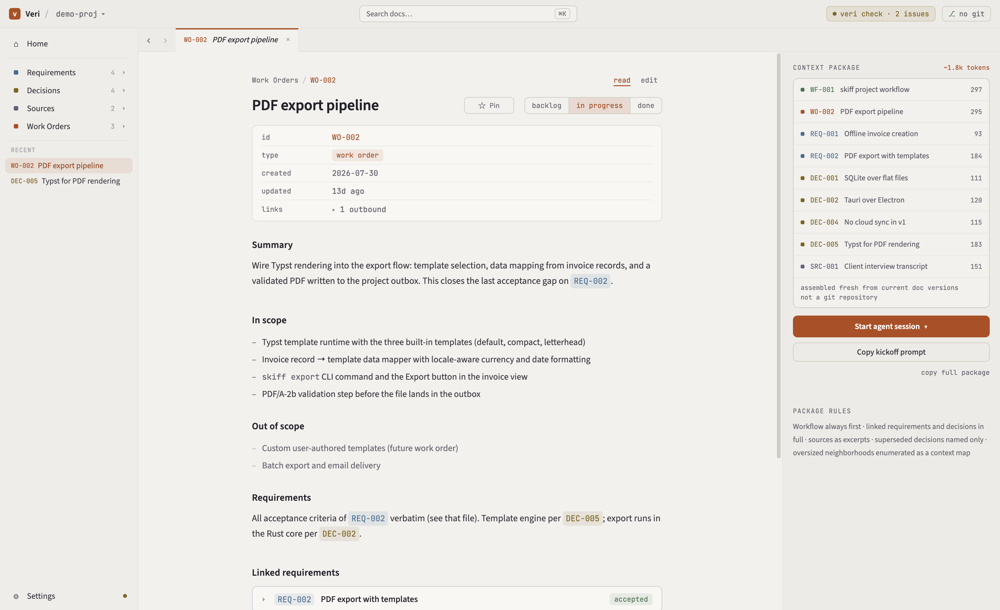

# Veri

[](https://github.com/danielyayla/veri/actions/workflows/ci.yml)
[](https://github.com/danielyayla/veri/releases/latest)
[](LICENSE)

A knowledge base your coding agents read — requirements, decisions, and
work orders as plain markdown files living in your repo. Veri hands an
agent a complete context package for any task over MCP, and everything
the agent writes back lands in files you review.

Veri is for developers who build with coding agents every day and are
done re-explaining their project's decisions at the start of each
session.

<picture>
  <source media="(prefers-color-scheme: dark)" srcset="site/assets/app-dark.png">
  
</picture>

**[Download Veri for macOS](https://github.com/danielyayla/veri/releases/latest)**
— macOS 13+, Apple silicon & Intel. Agents launch Veri's MCP server with
your own Node (20+).

Start with the **[10-minute quickstart](https://danielyayla.github.io/veri/docs/quickstart.html)**:
install → open the sample project → connect your agent → file a work
order → watch the agent use it. The
[website](https://danielyayla.github.io/veri/) covers the
[workflow](https://danielyayla.github.io/veri/docs/workflow.html),
[agent connection](https://danielyayla.github.io/veri/docs/connect-claude-code.html),
[CI gate](https://danielyayla.github.io/veri/docs/ci.html),
[team workflow](https://danielyayla.github.io/veri/docs/team.html),
[reference](https://danielyayla.github.io/veri/docs/reference.html), and
[troubleshooting](https://danielyayla.github.io/veri/docs/troubleshooting.html).

Veri is local-first and ships no telemetry: the knowledge base is a
`veri/` directory of markdown files in your repo, and the app's only
network access is checking GitHub Releases for updates.

This repo is self-hosted: Veri is built by executing Veri work orders
(see [veri/](veri/)).
[How Veri builds Veri](https://danielyayla.github.io/veri/docs/how-veri-builds-veri.html)
walks one real work order end to end — filing, approval, context
package, implementation, receipts — with every commit linked.

## Platforms

The desktop app runs on macOS 13+ (Apple silicon and Intel). No Windows
or Linux app exists yet, and none is currently scheduled. The CLI, MCP
server, and GitHub Action are plain Node and run anywhere Node 20+
does.

## Installing the CLI

There is no npm or Homebrew install path today. The npm name `veri`
belongs to an unrelated package — **do not** `npx veri`; it installs
someone else's software. Publishing `@veri/cli` under a controlled
scope is proposed (see
[DEC-077](veri/decisions/DEC-077-cli-packages-publish-under-a-controlled-npm-scope-bin-veri.md));
until that lands, the CLI ships two ways:

- **Inside the app** — the [macOS app](https://github.com/danielyayla/veri/releases/latest)
  bundles the same `@veri/cli` code it runs on, and CI runs it for you:
  the [Veri Check GitHub Action](https://danielyayla.github.io/veri/docs/ci.html)
  is the CLI's `check` in a workflow snippet.
- **From source** — clone this repo, then `npm install && npm test`;
  the binary is `packages/cli/dist/cli.js` (`node packages/cli/dist/cli.js check`,
  or `npm link -w @veri/cli` to get `veri` on your PATH).

## Development

Building from source (users: prefer the download above):

```bash
npm install
npm test        # builds all packages, then runs every test suite
```

Development requires Node >= 22.18 (native TypeScript type stripping, see
DEC-004); published output targets Node >= 20.

### Packages

- `@veri/core` — parse, validate, and graph a `veri/` directory
- `@veri/cli` — the `veri` binary: `init`, `new`, `check`, `approve`, `renumber`, `migrate`, `import`, `list`, `open`
- `@veri/mcp` — stdio MCP server: `get_context`, `search`, `file_decision`, `file_receipt`
- `@veri/action` — the Veri Check GitHub Action runner, bundled to `action/dist/` (the root `action.yml` is the published surface)
- `@veri/ui` — the Tauri 2 desktop app (Rust shell, Node sidecar)
- `site/` — the website, hand-authored static files deployed by CI

### Configuring the MCP server from a checkout

The installed app writes agent configs for you (see the
[connection page](https://danielyayla.github.io/veri/docs/connect-claude-code.html));
from a source checkout, wire it by hand. The server is stdio-based and
serves one project: pass the project root (the directory containing
`veri/`) as its argument.

After `npm install && npm test`:

```bash
claude mcp add veri -- node /path/to/veri/packages/mcp/dist/server.js /path/to/your/project
```

Or add a project-scoped `.mcp.json` next to your `veri/` directory:

```json
{
  "mcpServers": {
    "veri": {
      "command": "node",
      "args": ["/path/to/veri/packages/mcp/dist/server.js", "."]
    }
  }
}
```

(This repository's own [.mcp.json](.mcp.json) does exactly that.)

The server exposes ten tools — context packages, search, document
retrieval, and guarded write-back. The
[reference page](https://danielyayla.github.io/veri/docs/reference.html#mcp-tools)
lists each tool and what it returns.
